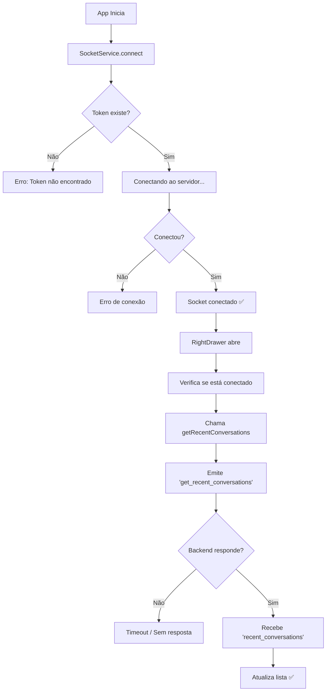

# 📊 Análise do Problema: get_recent_conversations

## 🎯 Problema Original

Você não estava conseguindo chamar o `get_recent_conversations` no socket do `RightDrawer`.

## 🔍 O que Descobri

### 1. **Código Encontrado**

O método `getRecentConversations()` existe em:

- ✅ `src/services/socketService.ts` (linha 242)
- ✅ Está sendo chamado no `src/components/RightDrawer.tsx` (linha 74)

### 2. **Possíveis Causas do Problema**

#### ❌ **Causa #1: Race Condition**

O código original chamava `getRecentConversations()` antes do socket estar completamente conectado.

**Código Antigo (com problema):**

```typescript
// Socket pode não estar conectado ainda
socketService.getRecentConversations();
```

**Código Novo (corrigido):**

```typescript
// Aguarda conexão antes de solicitar
socket.once('connect', () => {
  socketService.getRecentConversations();
});

// Se já estiver conectado, solicita imediatamente
if (socket.connected) {
  socketService.getRecentConversations();
}
```

#### ❌ **Causa #2: Falta de Logs**

Não havia logs para diagnosticar o problema, então você não sabia:

- Se o socket estava conectando
- Se o evento estava sendo emitido
- Se havia erros de conexão
- Se o backend estava respondendo

## ✅ Solução Implementada

### 1. **Adicionado Sistema de Logs Completo**

#### No `socketService.ts`:

```typescript
// Logs de conexão
console.log('[SocketService] Iniciando conexão do socket');
console.log(
  '[SocketService] ✅ Socket conectado com sucesso! ID:',
  this.socket?.id,
);

// Logs de eventos
console.log('[SocketService] 📤 Emitindo evento:', event);
console.log('[SocketService] 📬 Recebeu evento recent_conversations:', data);

// Logs de erros
console.error('[SocketService] ❌ Erro ao conectar socket:', error);
console.warn(
  '[SocketService] ⚠️ Tentativa de emitir evento sem socket conectado',
);
```

#### No `RightDrawer.tsx`:

```typescript
console.log('[RightDrawer] Iniciando configuração do socket');
console.log('[RightDrawer] Socket conectado, solicitando conversas recentes');
console.log('[RightDrawer] Recebeu recent_conversations:', data);
console.error('[RightDrawer] Erro de conexão do socket:', error);
```

### 2. **Melhorada a Lógica de Conexão**

- ✅ Aguarda socket conectar antes de emitir evento
- ✅ Verifica se já está conectado antes de solicitar
- ✅ Adiciona listeners de erro para capturar problemas
- ✅ Limpa listeners adequadamente

### 3. **Sistema de Logging Persistente**

Você agora tem:

- ✅ Logs salvos no AsyncStorage
- ✅ Interface visual para ver logs
- ✅ Filtros por tipo (erro, aviso, info)
- ✅ Exportação de logs
- ✅ Acesso fácil via menu lateral

## 🚀 Como Usar Agora

### Passo 1: Abrir os Logs

```
1. Abra o app
2. Menu lateral esquerdo
3. Clique em "Logs do App" 🐛
```

### Passo 2: Reproduzir o Problema

```
1. Abra o menu lateral direito (Right Drawer)
2. Observe os logs sendo gerados em tempo real
```

### Passo 3: Analisar

```
Veja a sequência de logs:
[SocketService] Iniciando conexão...
[SocketService] ✅ Conectado!
[RightDrawer] Solicitando conversas...
[SocketService] 📤 Emitindo evento...
[SocketService] 📬 Recebeu resposta!
```

## 📋 Fluxo Esperado



## 🐛 Possíveis Erros e Soluções

| Erro                                 | Causa                                    | Solução                                 |
| ------------------------------------ | ---------------------------------------- | --------------------------------------- |
| Token não encontrado                 | Usuário não está logado ou token expirou | Fazer login novamente                   |
| Erro ao conectar                     | Backend offline ou URL incorreta         | Verificar backend e URL                 |
| Socket desconecta logo após conectar | Erro de autenticação no backend          | Verificar validação de token no backend |
| Emite mas não recebe resposta        | Backend não está escutando o evento      | Verificar handler no backend            |
| Socket conecta mas não emite         | Race condition (já foi corrigida)        | Código já está corrigido                |

## 📊 Logs Importantes

### ✅ Sucesso

```
[SocketService] ✅ Socket conectado com sucesso! ID: abc123
[RightDrawer] Socket já conectado, solicitando conversas imediatamente
[SocketService] 📤 Emitindo evento: get_recent_conversations
[SocketService] 📬 Recebeu evento recent_conversations: {...}
[RightDrawer] Recebeu recent_conversations: {...}
```

### ❌ Erro de Token

```
[SocketService] Token não fornecido, buscando no storage
[SocketService] ❌ Token não encontrado, não é possível conectar
```

### ❌ Erro de Conexão

```
[SocketService] Iniciando conexão do socket
[SocketService] ❌ Erro ao conectar socket: Error: connect ECONNREFUSED
```

### ❌ Socket não conectado

```
[RightDrawer] Socket já conectado, solicitando conversas imediatamente
[SocketService] ⚠️ Tentativa de emitir evento sem socket conectado: get_recent_conversations
```

## 🎯 O que Fazer Agora

1. **Teste o app e veja os logs**

   - Veja se o socket conecta
   - Veja se o evento é emitido
   - Veja se recebe resposta

2. **Se houver erro, use o guia**

   - Consulte `SOCKET_DEBUG_GUIDE.md`
   - Use a tabela de erros acima

3. **Exporte os logs se necessário**

   - Clique em "Exportar" na tela de logs
   - Compartilhe para análise

4. **Verifique o backend**
   - Adicione logs no backend também
   - Veja se recebe o evento `get_recent_conversations`
   - Veja se responde com `recent_conversations`

## ✨ Benefícios da Solução

- ✅ **Visibilidade total** do que está acontecendo
- ✅ **Diagnóstico rápido** de problemas
- ✅ **Histórico de logs** salvos
- ✅ **Correção do race condition**
- ✅ **Tratamento de erros** melhorado
- ✅ **Exportação de logs** para análise

## 📚 Arquivos Criados/Modificados

### Criados:

- `src/services/loggerService.ts` - Sistema de logging
- `src/screens/LogViewerScreen.tsx` - Tela de visualização
- `SOCKET_DEBUG_GUIDE.md` - Guia de diagnóstico
- `SOCKET_ANALYSIS_SUMMARY.md` - Este arquivo

### Modificados:

- `src/services/socketService.ts` - Adicionados logs detalhados
- `src/components/RightDrawer.tsx` - Corrigido race condition + logs
- `src/navigation/AppNavigator.tsx` - Adicionada rota LogViewer
- `src/components/LeftDrawer.tsx` - Adicionado botão Logs do App
- `App.tsx` - Inicializa logger

---

**Agora você tem controle total sobre o socket e pode diagnosticar qualquer problema facilmente!** 🚀
